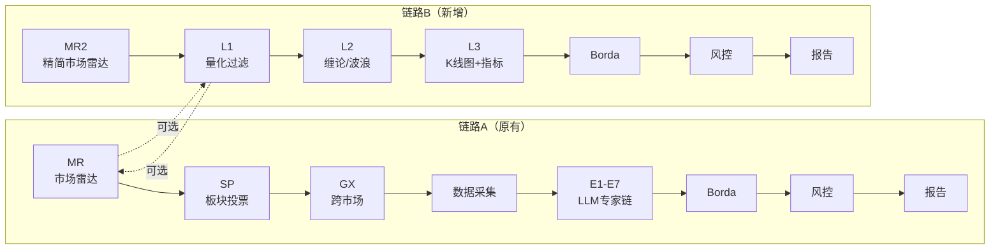

# Proposal: L1-L2-L3 量化选股链路（并行模式）

## 1. 现状

现有链路A：
```
MR → SP → GX → 数据采集 → E1-E7专家链 → Borda → 风控 → 报告
```

问题：
- E1-E7 全部基于文字描述，无量化锚点
- 候选股来源依赖板块划分，漏票
- 7轮LLM慢且筛选质量不稳

## 2. 目标

新增链路B，与链路A并行：

```
链路A（原有）: MR → SP → GX → 数据采集 → E1-E7专家链 → Borda → 风控 → 报告
链路B（新增）: MR2 → L1 → L2 → L3 → Borda → 风控 → 报告
```

用户可任选一条链路运行，或两条都跑。

## 3. 链路设计

### 3.1 MR2（市场雷达精简版）

MR2 是 MR 的精简版，只输出：
- 大盘环境（偏多/震荡/偏空）
- 情绪温度（亢奋/正常/冷淡）
- 仓位建议

不调用 SP/GX 全面板投票，开销更小。

### 3.2 L1 量化过滤（全市场扫描）

| # | 条件 | 量化方式 |
|---|------|---------|
| 1 | 持续放量 > 50% | 近3日成交量逐日递增，且总量增量 > 50% |
| 2 | K线收上均线 | 近10日收盘价全部 > MA5 且全部 > MA10 |
| 3 | 市值 ≤ 500亿 | 总市值 < 500亿 |
| 4 | PE < 50 或为空 | 动态PE < 50，为空不排除 |

输出：约 20-50 只候选股。

### 3.3 L2 形态过滤（缠论 + 波浪）

| # | 方法 | 库 |
|---|------|-----|
| 缠论 | 笔/线段/中枢位置判断（底部？中继？） | chan.py (github.com/Vespa314/chan.py) |
| 波浪 | ZigZag拐点 + RSI背离 | ta-lib / pandas-ta |

输出：约 12-18 只。

### 3.4 L3 K线图 + 指标（LLM看图）

为每只股票生成：
- K线图（含MA5/MA10/MA20）
- MACD 指标图
- KDJ 指标图
- RSI 指标图

调用 LLM 参照图表做最终判定，推荐约 10-15 只。

### 3.5 Borda → 风控 → 报告

链路B的输出接入原有的 Borda → 风控 → 报告流程。

## 4. 流程图



## 5. 受影响文件

- [ ] `stock_agents.py` — 新增 `MarketRadarLite`（MR2）
- [ ] `data_engine.py` — 新增 `L1_quant_filter()` + `L2_chan_wave_filter()` + `L3_chart_generator()`
- [ ] `main.py` — 新增 `--link` 参数选择链路：`--link b` 跑链路B，`--link a` 跑链路A（默认），`--link both` 两条都跑
- [ ] `config.py` — 链路选择相关配置
- [ ] `requirements.txt` — 新增依赖：`chan.py`（或直接 import），`ta-lib`（可选）
- [ ] `docs/features/quantitative-prescreen/` — 功能文档

## 6. 关键设计决策

1. **L1-L2 纯数值计算**，不调用 LLM，确保毫秒级完成
2. **L3 生成K线图截图**，需要 `matplotlib` 和 `mplfinance`，每张图约 0.5-1 秒
3. **全市场数据采集优化**：先拉实时行情做初筛，只对通过 L1 的股票补齐历史数据
4. **两条链路可独立运行**，也可都跑后做交叉对比
